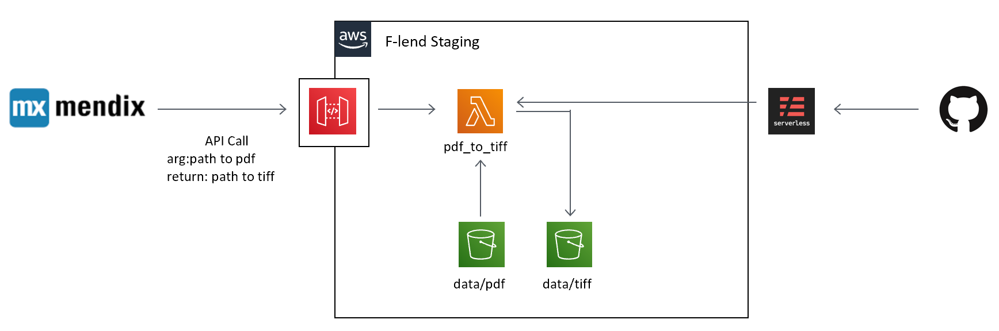

# PDF to TIFF API

PDF画像を(白黒=モノクロ2階調)TIFFへ変換するAPIです。
変換後の形式
- 解像度：400 dpi
- ファイル形式：マルチページTIFF
- カラー：モノクロ2階調
- 圧縮形式：CCITT Group 4

Dependency
* [pdf2image](https://github.com/Belval/pdf2image)
* [serverless framework](https://serverless.com/)

## デプロイ


※現在は上記の仕様を満たしていません。

1. 事前準備
    - dockerの環境構築
    - npmのインストール
    - serverless frameworkのインストール
      - `npm install -g serverless`
    - S3にデプロイ用のバケットの作成
      - バケット名：`ステージ名-pdf-to-tiff-deployment`
        例）`hogehoge-pdf-to-tiff-deployment`
            -> 作成されるリソースが全て`hogehoge-*`になる

2. 以下のコマンドを順番に実行してAWS Lambdaにデプロイするパッケージを作成する。
    ```
    docker build -t pdf-to-tiff .
    docker run -d --name package-build pdf-to-tiff
    docker cp package-build:deploy.zip src/
    docker rm package-build
    ```

3. 以下のコマンドでデプロイ
    ```
    sls deploy -v --stage ステージ名
    ```

## 仕様

### 処理フロー
Mendix -(pdf)-> API Gateway -(pdf)-> Lambda
                                      ￤
Mendix <-(tif)- API Gateway <--(tif)--￤

### 設計

#### リクエストヘッダー

| キー | 項目名 | 必須 | 属性 |
| --- | --- | --- | --- |
| x-api-key | APIキー | 必須 | 半角英数字 |
| Content-Type | コンテントタイプ | 必須 | 半角英字 |
| InputFileName | 入力ファイル名 | 必須 | 半角英数字 |
| OutputFileExtention | 出力ファイル拡張子 | 必須 | 半角英字 |

#### リクエストボディ

| 項目名 | 必須 | 属性 |
| --- | --- | --- |
| 入力ファイル | 必須 | ファイル |

#### レスポンスヘッダー

| キー | 項目名 | 属性 |
| --- | --- | --- |
| Content-Type | コンテントタイプ | 半角英字 |

#### レスポンスボディ

| 項目名 | 属性 |
| --- | --- |
| 出力ファイル | ファイル |

#### ステータスコード

| コード | ステータス |
| --- | --- |
| 200 | 成功 |
| 400 | 無効なリクエスト |
| 408 | タイムアウト |
| 503 | 変換失敗 |

### Fargate Style
[こちら](./development/README.md)を参照
